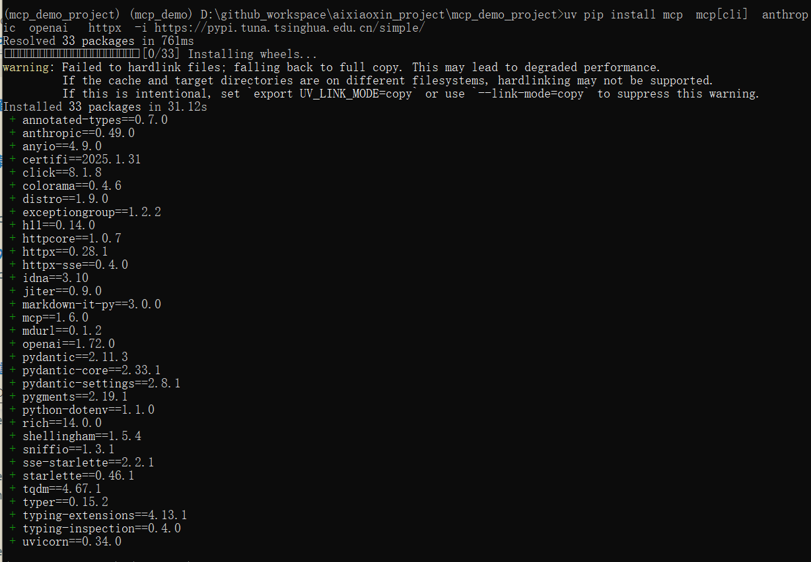
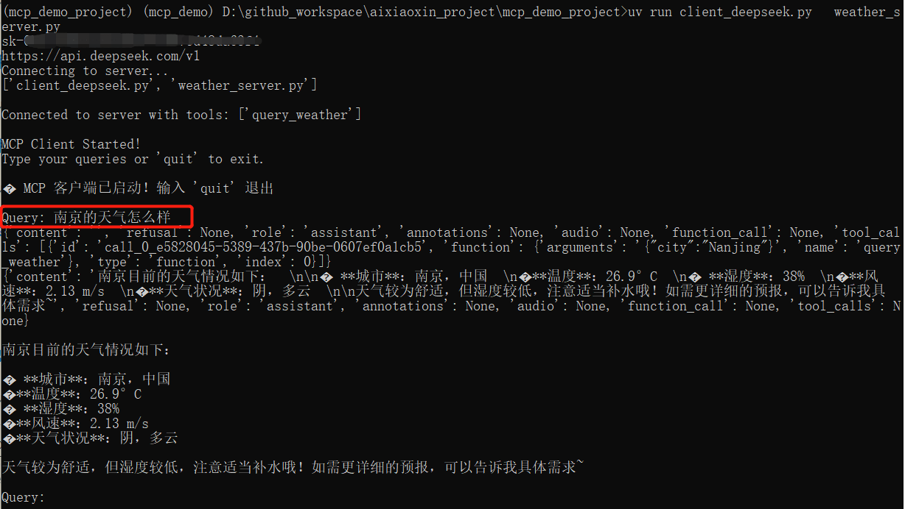
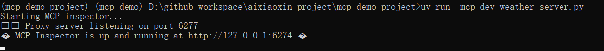
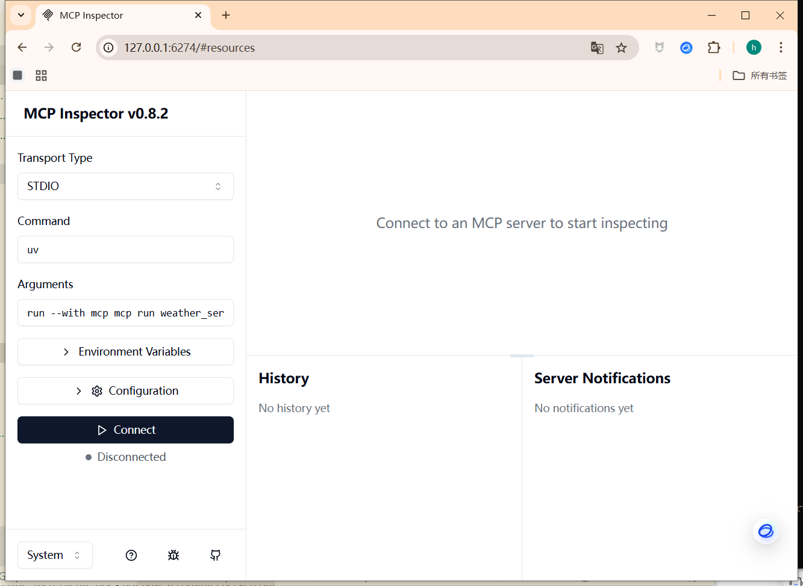
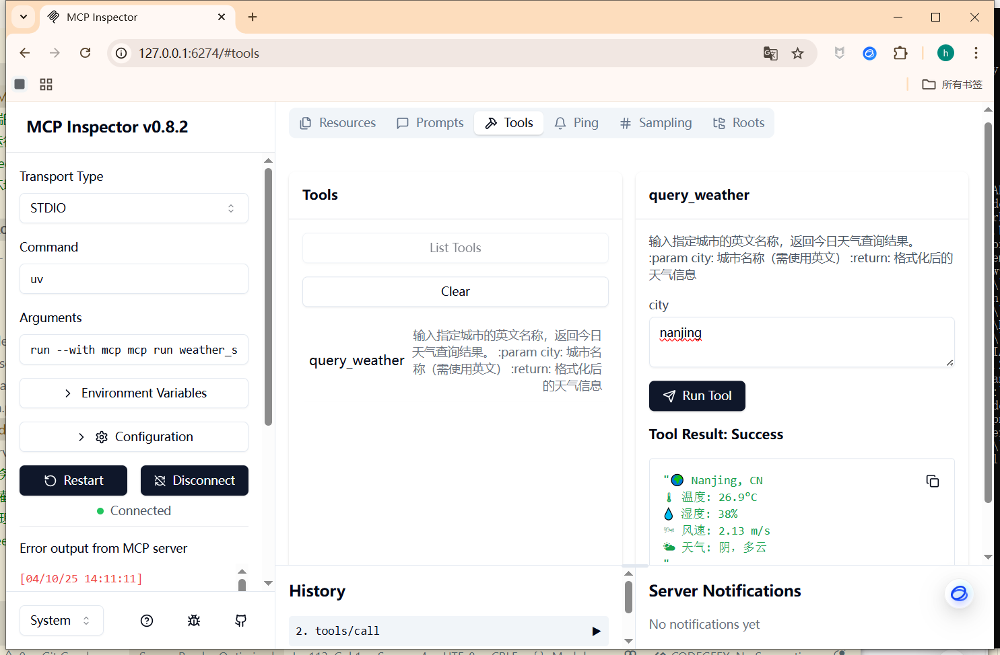

# 项目介绍
# mcp的天气查询的agent的完整示例

支持claude、openai、deepseek、qwen等大模型；
天气查询api，采用  openweathermap 
可以访问openweathermap的网址，获取apikey；   
网址：   https://home.openweathermap.org/subscriptions

作者公众号： AI小新  ， 有问题，可以加群交流；关注公众号，发送数字2，获取小助手微信；

# 下面开始部署教程

# 下载代码

git clone  https://github.com/aixiaoxin123/mcp_demo_project.git

# 进入代码目录
cd mcp_demo_project

# 创建conda环境

conda create -n mcp_demo  python=3.10

conda activate mcp_demo

# 安装uv 工具
pip install uv  -i https://pypi.tuna.tsinghua.edu.cn/simple/

uv --version

# 利用uv 在当前目录，创建一个虚拟环境
uv venv

# 激活虚拟环境
# linux 下命令
source .venv/bin/activate

# windows 下命令(作者用的此命令)
.venv\Scripts\activate

# uv 安装对应的依赖包
uv pip install mcp  mcp[cli]  anthropic  openai   httpx  -i https://pypi.tuna.tsinghua.edu.cn/simple/ 

截图：

# 启动mcp服务

## 运行 客户端和本地服务端

###   配置.env 文件，填入你的大模型密钥

### 利用deepseek大模型进行问答

uv run client_deepseek.py   weather_server.py

### 利用qwen大模型进行问答

uv run client_qwen.py   weather_server.py

### 利用openai模型进行问答

uv run client_openai.py   weather_server.py

### 运行deepseek的截图

## 当然你也可以单独运行 mcp服务端，用于提供给互联网环境使用

uv run  mcp dev weather_server.py

运行截图：

运行成功后，可以访问：
http://127.0.0.1:6274

服务端的管理界面：

服务端-工具列表使用截图：

# 参考教程：
mcp官方的文档：
https://mcp-docs.cn/introduction